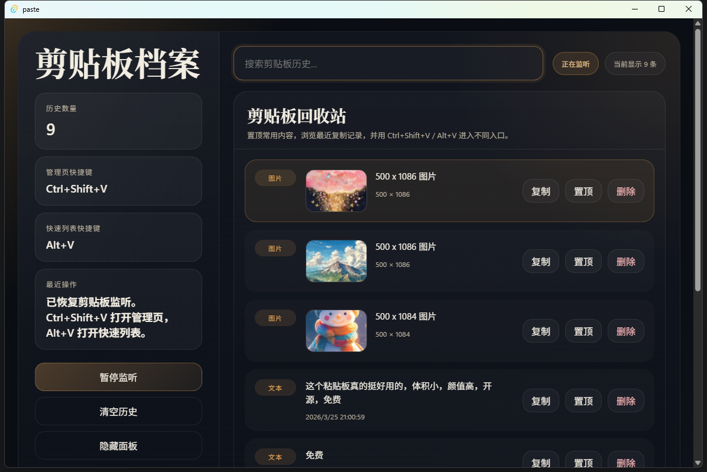
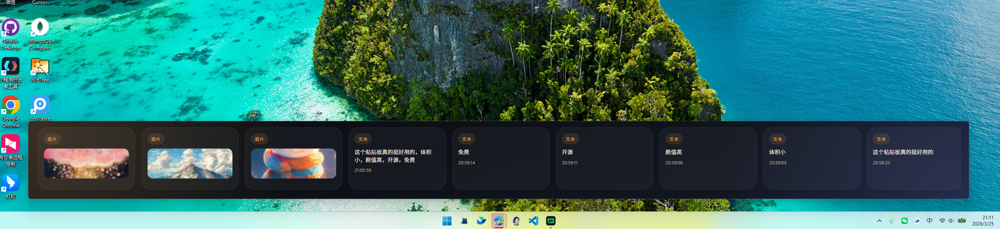

# paste

[中文说明](./README.zh-CN.md)

A Windows-first local clipboard manager built with `Tauri 2 + Vue 3 + TypeScript + Rust`.

## Overview

`paste` is a Paste-inspired clipboard utility focused on two entry points:

- A full management window for browsing, searching, pinning, deleting, and controlling clipboard history
- A bottom quick picker for high-frequency access to recent clipboard items

The app runs as a tray-resident desktop utility, stores data locally, and currently targets Windows first.

## Screenshots

### Management Window



### Bottom Quick Picker



## Current Features

- Tray-resident app lifecycle
- Two global hotkeys
- `Ctrl+Shift+V` opens the management window
- `Alt+V` opens the bottom quick picker
- Clipboard monitoring for `text` and `image`
- Local persistence with `SQLite`
- Image file caching in the app data directory
- Content deduplication
- Text items are deduplicated by normalized content
- Image items are deduplicated by content hash
- Pin / unpin clipboard items
- Delete single items
- Clear all history
- Pause clipboard monitoring
- Search clipboard history in the management window
- Double-click to copy from the bottom picker
- Tray menu entries for management window, quick picker, pause/resume, clear history, and quit

## Current Behavior

- The app starts hidden and stays in the system tray
- Closing the management window or quick picker hides the window instead of exiting the process
- Pinned items stay at the top
- Unpinned history is capped at `500` items
- Image data is stored as files, while metadata is stored in SQLite
- The bottom quick picker is centered near the bottom of the screen and resizes based on visible item count

## Tech Stack

- Frontend: `Vue 3`, `TypeScript`, `Vite`
- Desktop shell: `Tauri 2`
- Backend: `Rust`
- Storage: `SQLite` via `sqlx`

## Project Structure

```text
src/                  Vue frontend
src/App.vue           Management window
src/PickerApp.vue     Bottom quick picker
src/lib/commands.ts   Frontend-to-Tauri commands
src-tauri/src/        Rust backend modules
src-tauri/src/lib.rs  Tauri app setup and commands
src-tauri/src/storage.rs
src-tauri/src/clipboard_monitor.rs
src-tauri/src/hotkey.rs
src-tauri/src/tray.rs
src-tauri/src/windowing.rs
```

## Tauri Commands

The frontend currently uses these commands:

- `get_history`
- `get_app_state`
- `copy_item_to_clipboard`
- `toggle_item_pin`
- `delete_item`
- `clear_history`
- `set_monitoring_paused`
- `hide_window`
- `sync_picker_layout`

## Development

### Prerequisites

- `Node.js`
- `pnpm`
- `Rust`
- Tauri v2 build prerequisites for Windows

### Install

```bash
pnpm install
```

### Run in Development

```bash
pnpm tauri dev
```

### Build Frontend

```bash
pnpm build
```

### Build Desktop App

```bash
pnpm tauri build
```

## Storage

Application data is stored locally in the app data directory:

- SQLite database: `paste.sqlite`
- Cached images directory: `images/`

No cloud sync or remote account system is included in the current version.

## Scope Notes

Implemented now:

- Local clipboard history for text and images
- Management page
- Bottom quick picker
- Tray integration
- Keyboard-first workflows in the management page

Not implemented yet:

- Cloud sync
- Rich text / HTML history
- File list clipboard support
- App blacklist rules
- Custom hotkey settings UI
- Auto-paste workflows

## License

This repository currently does not declare a license.
